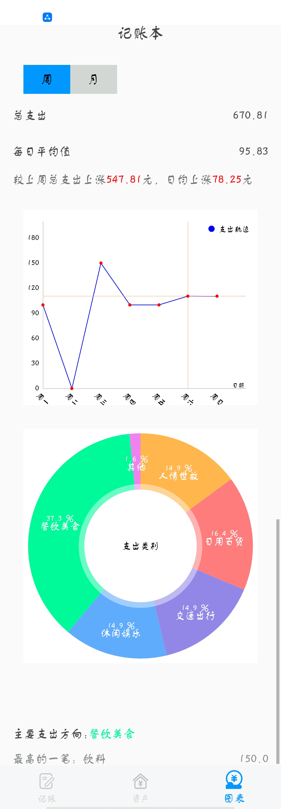
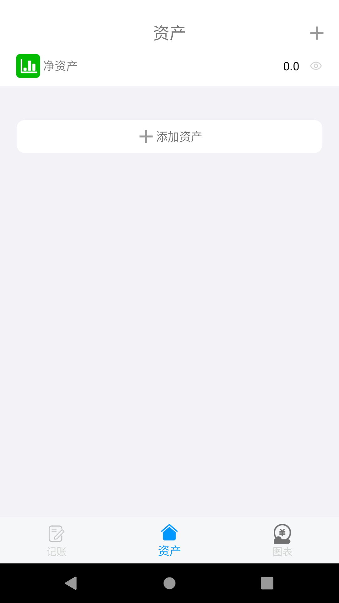
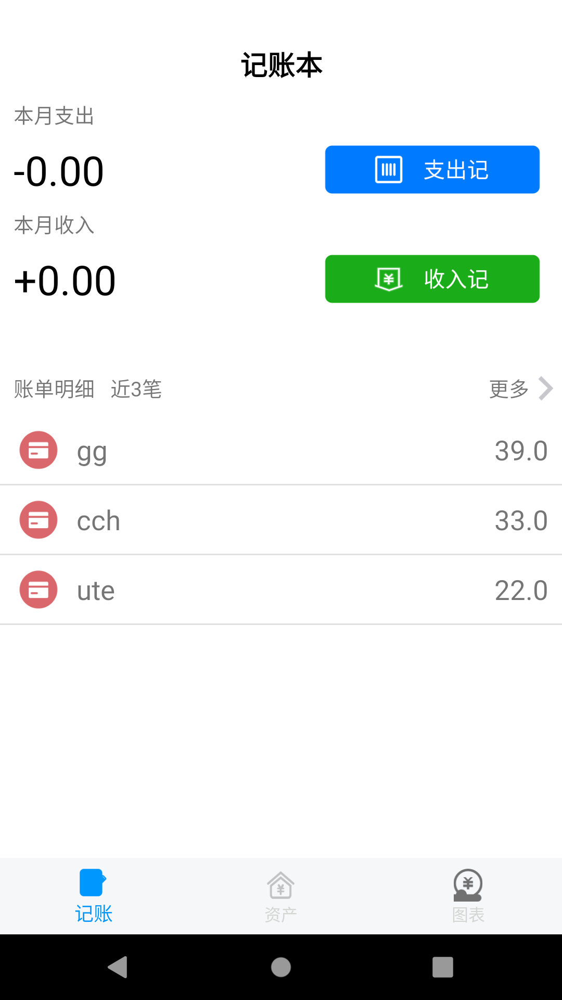

# Keep_Book_App

# 一、项目总体规划需求分析

实现个人资产管理应用

记账项目分为三个模块：记账，资产，图标；

记账模块主要实现支出计，收入计，以及账单明细，支出计用于记录在指定日期的支出及备注信息，收入计用于记录收入及备注信息，最后保存在数据库中，在记账首页，可以显示近3笔支出收入情况，点击更多，可以查询所有账单信息，点击各个账单可以对它进行编辑

 

# 二、各模块需求分析

1、账单记录模块

- a、可以选择支出或是收入
- b、选择账单日期
- c、选择账单内容
- d、输入备注
- e、使用标签快速输入备注
- f、首页实时显示本月支出和收入

2、资产管理模块

- a、添加资产

- b、自定义资产

- c、设置资产的显示与隐藏

- d、显示资产金额

  

3、报表模块

- a、按周、月显示收支轨迹
- b、按周、月显示收支类别
- c、显示本周、月最高支出类别

# 三、应用业务流程设计

## 1、流程图

# 四、任务面板截图

# 五、项目运行截图

